# 基于手机视频的室内高精度重建技术方案

## 一、方案概述

本方案面向 GDC 2026 竞赛题目二“基于手机视频的室内高精度重建”，以 PlanarGS 的室内重建思路为基础，结合 COLMAP 或 mast3r-sfm 进行相机位姿与稀疏重建、DUSt3R 生成几何先验、Grounded-SAM 生成平面先验，并进一步引入 3D Gaussian Splatting 进行高保真重建。最终通过 TSDF 融合生成可查看的三角网格，并使用点云到点云距离指标对重建结果进行几何精度评估。


## 二、算法流程与关键流程

### 1. 数据组织与输入准备

这部分按照数据集下的README.md中的要求：

对每个测试序列，输入其 images 目录中的连续图像帧。对不同场景，将图像按照时间顺序组织，并准备 sparse 目录与参考真值点云 gt/gt_pd.ply。使用了原始数据中手机镜头的内参：
```text
  "w": 738,
  "h": 994,
  "fl_x": 809.3032856727216,
  "fl_y": 807.4371289882238,
  "cx": 368.0097263362558,
  "cy": 503.0891797364038,
```

### 2. 数据预处理

使用 COLMAP（或 mast3r-sfm）得到相机内外参与稀疏点云。项目中的脚本 run_colmap.sh 说明了 COLMAP 流程，mast3r-sfm 的调用方式见第三节。

并且使用 DUSt3R 生成多视图几何先验。具体流程为：

- 将图像按分组采样后输入 DUSt3R；
- 生成相机视角下的深度和法向几何先验；
- 将先验深度与 COLMAP 或 mast3r-sfm 的相机模型进行对齐与缩放，得到可用于训练的几何约束。

以此为后续 Gaussian Splatting 训练提供稳定的深度/法向监督，减轻纯图像重建在弱纹理区域的退化问题。

### 3. 平面先验生成

针对室内墙面、地面、门、窗、桌面等平面结构，使用 Grounded-SAM 的开放词汇分割能力，生成语言提示下的平面候选区域。随后将这些掩码与训练过程中的深度渲染结果进行约束，使平面结构在重建中保持更强的几何一致性与边界完整性。

### 4. PlanarGS 训练与重建

在完成相机和先验信息准备后，进入 PlanarGS 的高精度重建阶段。训练过程中主要包含以下模块：

- 以 3D Gaussian Splatting 为基础表示场景；
- 使用 RGB 图像损失作为基础重建约束；
- 引入几何先验损失，强制深度与法向与先验保持一致；
- 引入平面先验损失，约束室内主要平面结构的几何形状；
- 通过密集化与裁剪机制动态调整高斯点分布，提升局部细节与表面完整性。

训练结束后，保存 point_cloud.ply，并利用渲染结果生成深度图与法向图，最终通过 TSDF 融合得到 mesh。项目中的 render.py 会输出 tsdf_fusion.ply 与 tsdf_fusion_post.ply，其中后者经去小块孤立连通分量、去退化三角形和无引用顶点清理后，质量更适合可视化与评估。

## 三、运行方式
我们训练时使用Linux服务器上的NVIDIA GeForce RTX 3090，操作流程参考PlanarGS中的使用说明，具体如下：
### 1. 环境准备
安装必要依赖库：
```bash
conda create -n planargs python=3.10
conda activate planargs
pip install cmake==3.20.*

pip install torch==2.4.1 torchvision==0.19.1 torchaudio==2.4.1 --index-url https://download.pytorch.org/whl/cu118  #replace your cuda version

pip install -r requirements.txt 

pip install -e submodules/simple-knn --no-build-isolation 
pip install -e submodules/pytorch3d --no-build-isolation   
pip install submodules/diff-plane-rasterization --no-build-isolation
```
安装GroundedSAM：
```bash
cd submodules 
git clone https://github.com/IDEA-Research/Grounded-Segment-Anything.git 
mv Grounded-Segment-Anything groundedsam

cd groundedsam
pip install -e segment_anything
pip install --no-build-isolation -e GroundingDINO
cd ../..
```

### 2. 数据预处理与重建流程

流程如下：

1. 使用 COLMAP（或用 mast3r-sfm 替代）生成相机位姿与稀疏点云（sparse 目录）；
2. 使用 `run_geomprior.py` 生成几何先验（DUSt3R 深度/法向）；
3. 使用 `run_lp3.py` 生成平面先验（Grounded-SAM 语义掩码）；
4. 运行 `train.py` 完成 3D Gaussian Splatting 训练重建；
5. 运行 `render.py` 渲染并生成 TSDF 融合网格。

运行前需先激活 conda 环境：
```bash
conda activate planargs
```

对应命令如下：

```bash
# ========== 1. 相机位姿估计 ==========
# 方式 A: 使用 COLMAP（进入数据目录执行）
cd <your_data_directory>
bash run_colmap.sh

# 方式 B: 使用 mast3r-sfm（在项目根目录执行）
# bash run_mast3r_seq04.sh

# ========== 2. 生成几何先验（DUSt3R）==========
python run_geomprior.py -s <data_path> --group_size 40

# ========== 3. 生成平面先验（Grounded-SAM）==========
python run_lp3.py -s <data_path> -t "wall. floor. door. screen. window. ceiling. table"

# ========== 4. 训练重建 ==========
python train.py -s <data_path> -m <output_path> --eval

# ========== 5. 渲染并生成 mesh ==========
# 完整渲染（训练图 + 测试图 + TSDF 融合生成网格）
python render.py -s <data_path> -m <output_path> --voxel_size 0.02 --max_depth 100.0

# 或仅渲染测试图（跳过 TSDF 网格生成，速度更快）
# python render.py -s <data_path> -m <output_path> --skip_train
```
若未预先下载必要的模型权重（DUSt3R / GroundingDINO / SAM），请将对应 `.pth` 文件放入 `ckpt/` 目录下。下载失败时可添加镜像环境变量：
```text
HF_ENDPOINT=https://hf-mirror.com
```

若生成几何先验时显存不足，可适当减小 `--group_size`。

### 3. 结果输出

最终可得到以下结果：

- 重建点云：`point_cloud.ply`；
- 渲染结果：颜色图、深度图、法向图（见 `<output_path>/train`、`<output_path>/test`）；
- 三角网格：`mesh/tsdf_fusion_post.ply`；

## 四、精度评估流程（最终采用方案）

### 1. 评估数据准备

本次最终评估流程以 CloudCompare 的点云距离计算结果为核心输入。

在正式评估之前，我们针对明显不合理的现象做出了恰当的修正：

Sequence_02的重建结果如下，其中有窗户外面的部分（见下图绿色部分），然而ground truth里并不包含。于是手动将重建结果中的这部分删去。同理，我们也手动删除了其他序列中不在室内范围的噪声点。

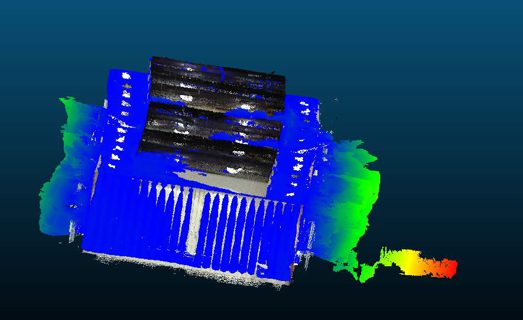

做完这些处理后，具体评估步骤如下：

1. 将重建结果的mesh采样得到点云（使用mesh_to_pointcloud.py），数量与gt保持一致，然后与参考真值点云 gt/gt_pd.ply 导入 CloudCompare；
2. 完成粗对齐与ICP迭代精对齐，使重建模型与真值点云处于同一坐标系与尺度，使用 Cloud-to-Cloud Distance 功能计算重建点云到参考点云的距离；
3. 将计算结果导出为文本文件，包含距离列（列名为 C2C_absolute_distances）。

### 2. 脚本解析与指标统计

评估脚本为项目中的 parse_cc_report.py。其主要功能是：

- 读取 CloudCompare 导出的 txt 文件；
- 自动识别表头中的距离列 C2C_absolute_distances；
- 提取该列所有距离值；
- 计算平均误差、中位数误差、RMSE、90%/95% 分位误差，以及 20 cm 与 10 cm 内点比例；
- 输出控制台结果，并生成对应的 JSON 汇总文件。

对应命令如下：

```bash
python parse_cc_report.py -i <your_directory_of_"cloudcompare_export.txt">
```

其中，输入文件为 CloudCompare 成功导出的距离结果文本文件，表头中包含 C2C_absolute_distances 列。

### 3. 评价指标

使用以下指标描述重建质量：

- 平均距离误差（Mean Error）；
- 中位数距离误差（Median Error）；
- 均方根误差（RMSE）；
- 90% / 95% 分位误差；
- 20 cm 内点比例；
- 10 cm 内点比例。

## 五、评估结果与分析

基于 CloudCompare 导出的距离结果文件与 parse_cc_report.py 的统计流程，评估结果如下：

| 序列 | 平均误差(cm) | 中位误差(cm) | RMSE(cm) | 90%分位(cm) | 95%分位(cm) | 20cm内点比例 | 10cm内点比例 |
| --- | ---: | ---: | ---: | ---: | ---: | ---: | ---: |
| Sequence_01 | 4.627 | 2.395 | 8.145 | 10.197 | 18.096 | 95.81% | 89.79% |
| Sequence_02 | 5.794 | 3.795 | 8.593 | 13.559 | 18.546 | 95.91% | 84.90% |
| Sequence_03 | 3.473 | 1.916 | 6.881 | 6.596 | 9.433 | 98.00% | 95.51% |
| Sequence_04 | 20.174 | 15.080 | 26.995 | 46.308 | 58.190 | 59.97% | 38.12% |
| Sequence_05 | 3.551 | 2.707 | 4.960 | 7.082 | 10.640 | 99.39% | 94.34% |

其中Sequence_04的重建效果并不理想

按照上述五个序列汇总，平均指标如下：

- 平均误差 (cm)	7.524
- 中位误差 (cm)	5.179
- RMSE (cm)	11.115
- 90%分位 (cm)	16.748
- 95%分位 (cm)	22.981
- 20cm内点比例	89.82%
- 10cm内点比例	80.53%

## 六、误差热力图可视化结果

为了更直观地观察各序列在 CloudCompare 中的误差分布与重建表面与参考点云的吻合情况，以下给出 5 个测试序列的误差热力图展示。每个序列分别提供两幅视角图，分别从重建结果的左右两侧观察，便于判断局部翘曲、空洞、边界偏移以及明显的几何异常区域。

### Sequence_01

<div align="center">
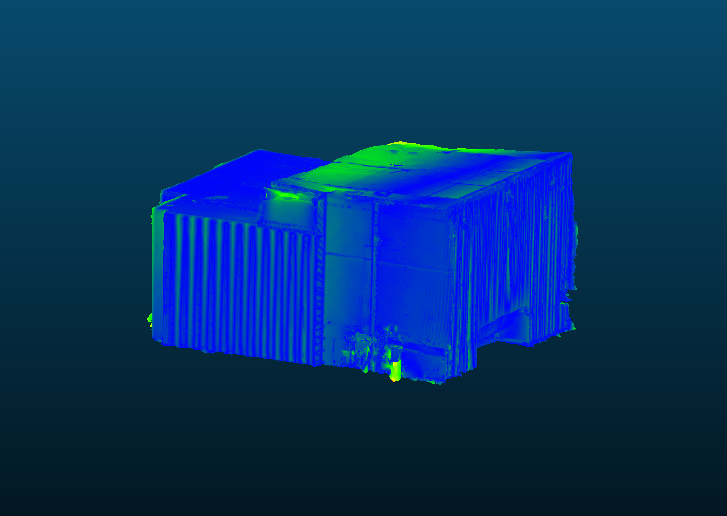
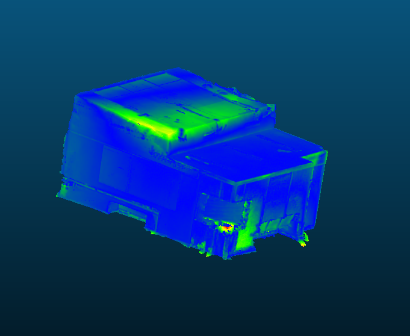
</div>

### Sequence_02

<div align="center">
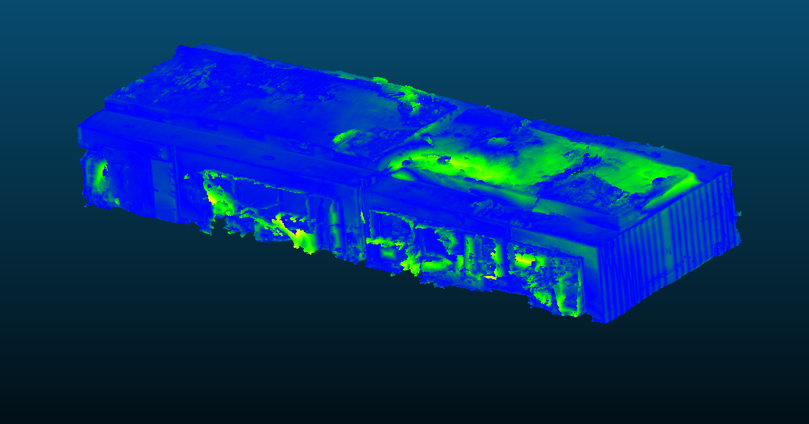
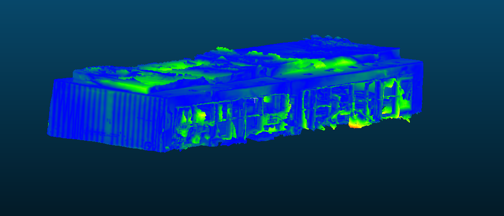
</div>

### Sequence_03

<div align="center">
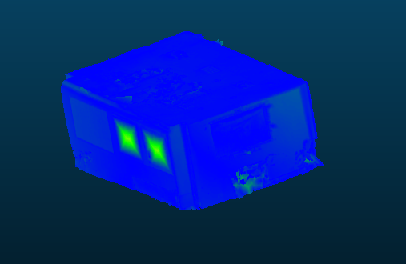
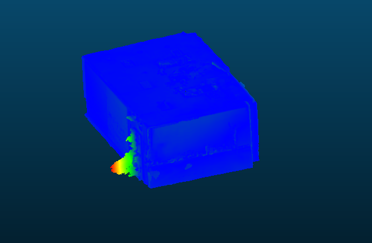
</div>

### Sequence_04

<div align="center">
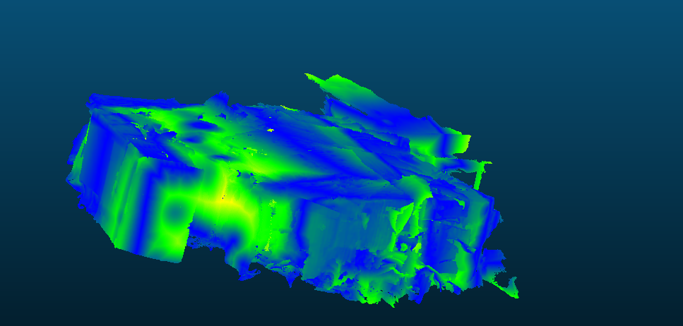
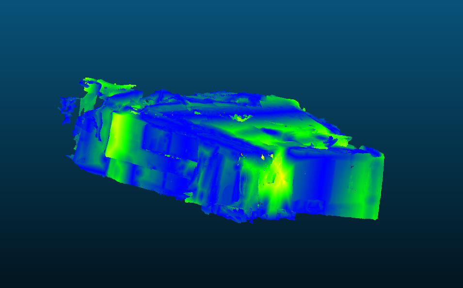
</div>

### Sequence_05

<div align="center">
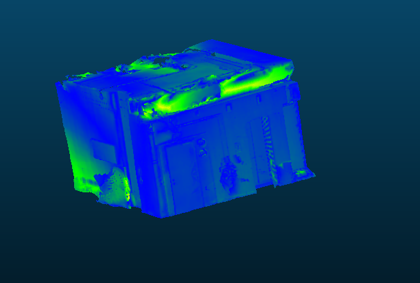
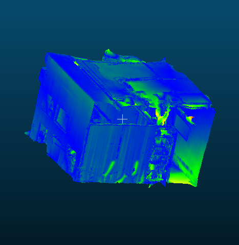
</div>

